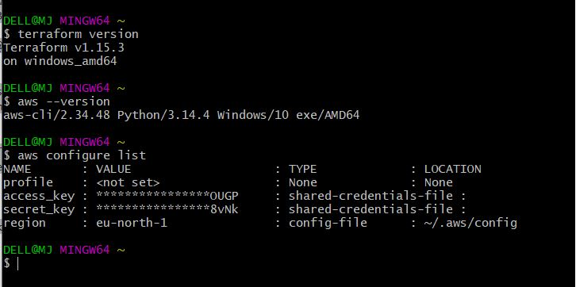

# Day 01 - Environment Setup and Introduction to Terraform

---

1. **AWS Account**
   - Created an AWS account (free tier)
   - Set up an IAM user with AdministratorAccess for Terraform (for learning purposes)
   - Generated Access Key ID and Secret Access Key

2. **Terraform**
   - Installed Terraform v1.14.7 on my local Windows machine
   - Verified installation using:
```bash
     terraform version
```

3. **AWS CLI**
   - Installed AWS CLI
   - Configured credentials:
```bash
     aws configure
```
   - Verified connection using:
```bash
     aws sts get-caller-identity
```
   - Display the configuration settings currently being used by the AWS CLI
```bash
     aws configure list 
```


4. **Visual Studio Code**
   - Installed VS Code
   - Added extensions:
     - HashiCorp Terraform
     - AWS Toolkit
   - Set up workspace for all Terraform files

5. **Blog Setup**
   - Created a post on Dev.to
   - Published first post: *What is Infrastructure as Code and Why It's Transforming DevOps*
     https://dev.to/mj16/what-is-infrastructure-as-code-and-why-its-transforming-devops-le9

6. **Reading**
   - Read Chapter 1 of *Terraform: Up & Running* by Yevgeniy Brikman
   - Focus areas: what Terraform is, why infrastructure-as-code matters, and how declarative tooling differs from manual provisioning

---

## Key Commands and Checks
```bash
# Verify Terraform
terraform version

# Verify AWS connection
aws sts get-caller-identity
```
---
