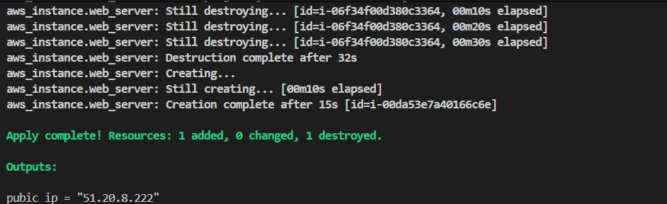
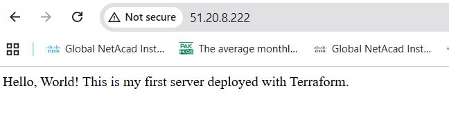
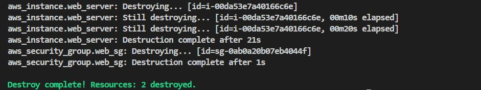

## Deploying Your First Server with Terraform


Today is where Terraform goes from theory to practice. The goal was to write
real Terraform code, deploy a working web server on AWS, confirm it serves
an HTML page over HTTP, and tear it down cleanly. Two core building blocks
were introduced today: the provider block and the resource block.

---

## Tasks Completed

1. Read Chapter 2 of *Terraform: Up & Running* — sections on Deploying a
   Single Server and Deploying a Web Server
2. Completed Lab 1: Intro to the Terraform Provider Block
3. Completed Lab 2: Intro to the Terraform Resource Block
4. Deployed a web server on AWS using Terraform
5. Confirmed the server was reachable in the browser
6. Destroyed all resources after confirmation
7. Published blog post

---

## Terraform Code
```hcl
provider "aws" {
  region = "eu-north-1"
}
resource "aws_security_group" "web_sg" {
  name        = "web-sg"
  description = "Allow HTTP traffic"

  ingress {
    from_port   = 80
    to_port     = 80
    protocol    = "tcp"
    cidr_blocks = ["0.0.0.0/0"]
  }
  egress {
    from_port   = 0
    to_port     = 0
    protocol    = "-1"
    cidr_blocks = ["0.0.0.0/0"]
}

}

resource "aws_instance" "web_server" {
    ami = "ami-0028809abe98af413"
    instance_type = "t3.micro"
    vpc_security_group_ids = [aws_security_group.web_sg.id]
    associate_public_ip_address = true

    user_data = <<-EOF
                #!/bin/bash
                apt update -y
                apt install nginx -y
                systemctl start nginx
                systemctl enable nginx
                echo "Hello, World! This is my first server deployed with Terraform." > /var/www/html/index.html
                EOF

    #so that when you change the user_data parameter and run apply,Terraform will terminate the original instance and launch a totally new one.            
    user_data_replace_on_change = true

    tags = {
        Name = "first-iac-Server"
    }
}

output "pubic_ip" {
  value = aws_instance.web_server.public_ip
  description = "web_server's public ip"
```

---

## Deployment Output


---

## Server Confirmation

Opened `http://http://51.20.8.222/` in the browser and confirmed the page loaded


---

## Destroy Output


---


## Key Commands Used
```bash
# Initialise the working directory and download the AWS provider
terraform init

# Preview what Terraform will create before touching AWS
terraform plan

# Deploy the infrastructure
terraform apply

# Tear down all resources after confirmation
terraform destroy
```

---

## What I Learned

**Provider block vs resource block**

The provider block tells Terraform which cloud platform to target and how
to connect to it. Without it Terraform has no destination for its API
calls. The resource block describes a specific piece of infrastructure you
want to exist. Terraform reads all resource blocks, works out the
dependencies between them, and creates them in the right order. The
security group was created before the EC2 instance because the instance
block references the security group ID directly.

**What terraform plan actually does**

Plan does not touch AWS. It reads your configuration, compares it against
the current state file, and produces a diff of what will change. A plus
sign means the resource will be created, a minus sign means it will be
deleted, and a tilde means it will be updated in place. Today the plan
showed 2 to add, 0 to change, 0 to destroy, which matched exactly what
was deployed.

Here is the published post: https://dev.to/mj16/deploying-your-first-server-with-terraform-a-beginners-guide-52da
---

## Challenges and Fixes

The AMI ID used should be available in your region. Use AWS CLI to fetch the correct Ubuntu 20.04 AMI ID and free-tier instance type:

```bash
aws ec2 describe-images \
  --owners 099720109477 \
  --filters "Name=name,Values=ubuntu/images/hvm-ssd/ubuntu-focal-20.04-amd64-server-*" \
  "Name=state,Values=available" \
  --query "sort_by(Images, &CreationDate)[-1].ImageId" \
  --output text \
  --region eu-north-1
```

```bash
$ aws ec2 describe-instance-types \
> --filters Name=free-tier-eligible,Values=true \
> --query "InstanceTypes[*].InstanceType"

```
---
